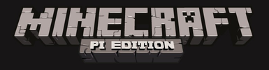

[마인크래프트](https://minecraft.net/)는 2011년 인디 게임으로 처음 시작된 이래로 많은 사람들의 사랑을 받고 있다.
[라즈베리 파이](https://www.raspberrypi.org/) 내부에 인기 마인크래프트 게임이 내장되어 누구나 쉽게 게임을 즐길 수가 있으며, 또한 [파이썬](https://www.python.org/)도 함께 있어 바로 파이썬으로 마인크래프트 프로그래밍을 시작할 수 있다.
라즈베리파이 재단 공식 웹사이트 [GETTING STARTED WITH MINECRAFT PI](https://www.raspberrypi.org/learning/getting-started-with-minecraft-pi/) 기반으로 학습을 시작한다.

마인크래프트(minecraft)는 개방된 세상을 구축하는 대중적인 모래 놀이통 게임이다.
마인크래프트 무료 버젼을 라즈베리 파이에서 이용할 수 있다; 또한 프로그래밍 인터페이스도 함께 제공된다.
프로그래밍 인터페이스를 제공한다는 의미는 파이썬 코드로 명령어와 스크립트를 작성하면 자동적으로 게임에서 원하는 바를 만들 수 있다는 것이다. 파이썬을 학습하는 훌륭한 방법이다!!!

## 학습주제
		
1.  [마인크래프트 설치](00-install.html)
2.  [파이썬 프로그래밍](01-python.html)
3.  [두더지 잡기 게임 만들기 (개발중)](02-whac-a-block.html)

## [번역 라이센스](license.html)

영어 원문과 동일한 라이센스가 [xwMOOC](http://xwmooc.net/)에서 작업한 한국어 번역 저작물에도 적용됩니다.

