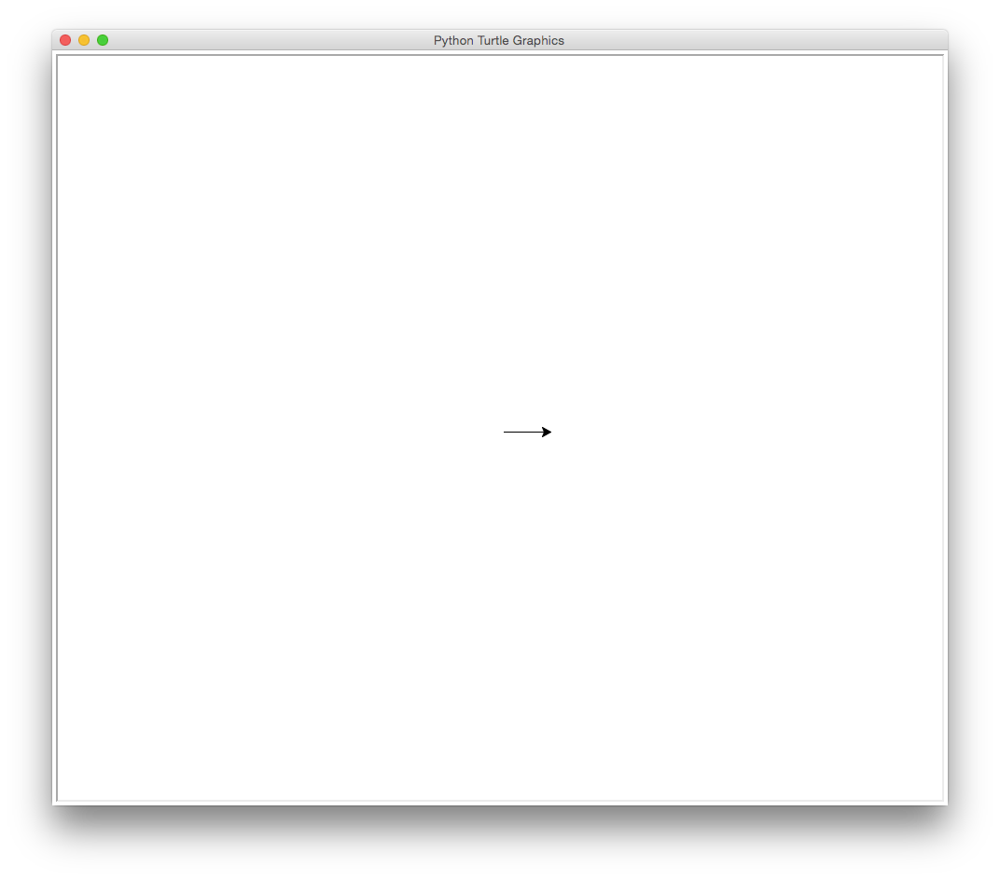
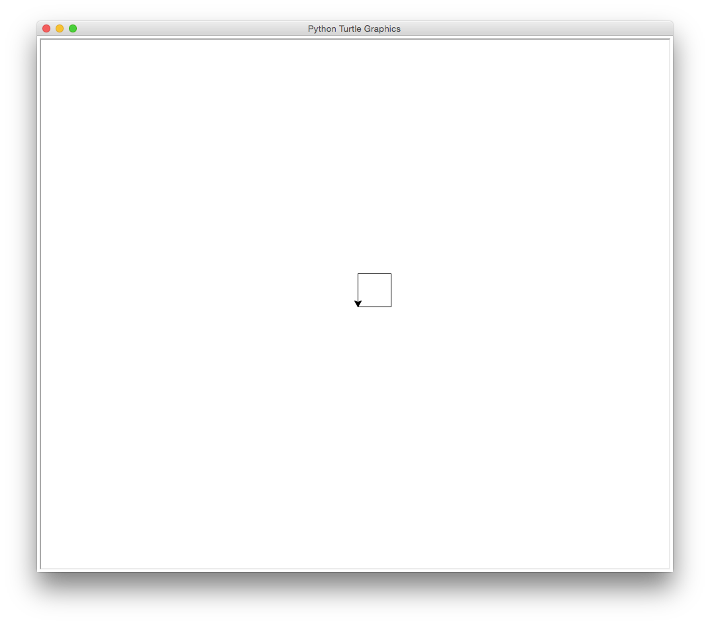
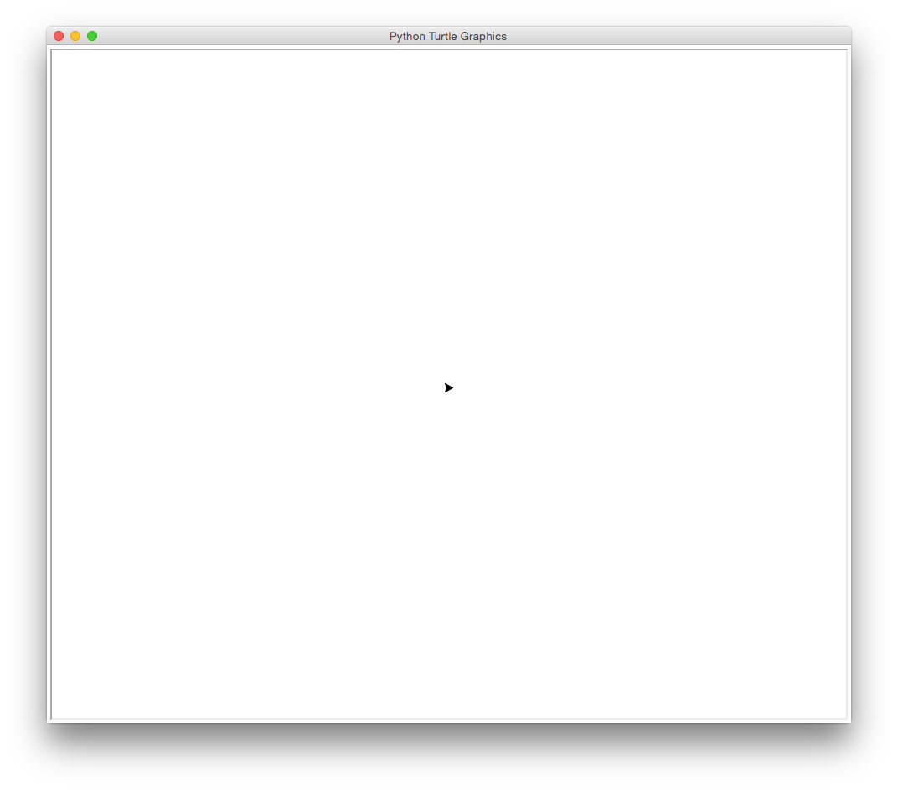
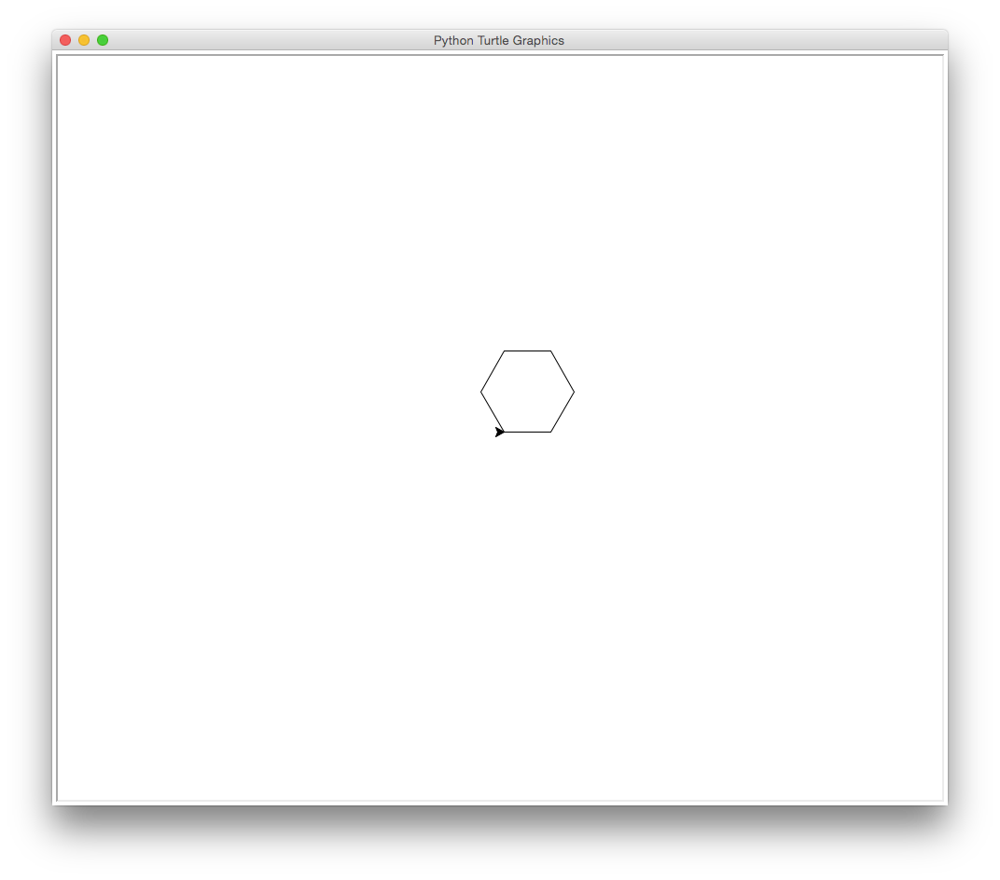

> ## 학습 목표 {.objectives}
>
> *   라이브러리가 무엇인지, 무슨 라이브러리가 사용되는지 설명한다.
> *   파이썬 라이브러리를 적재하고, 라이브러리가 담고 있는 것을 사용한다.
> *   변수에 값을 대입한다.
> *   거북이 그래픽 라이브러리를 사용해서 선을 그린다.
> *   리터럴 리스트(literal list, 상수 리스트)에 대해 `for` 루프(loop) 생성한다.
> *   `range`로 생성된 리스트에 대해 `for` 루프(loop) 생성한다.
> *   `for` 루프를 사용해서 간단한 다각형을 그린다.

명령 쉘에서 파이썬을 인터랙트브 모드로 실행해서 시작해봅시다.

~~~ {.input}
$ python
~~~
~~~ {.output}
Python 2.7.8 |Anaconda 2.1.0 (x86_64)| (default, Aug 21 2014, 15:21:46) 
[GCC 4.2.1 (Apple Inc. build 5577)] on darwin
Type "help", "copyright", "credits" or "license" for more information.
Anaconda is brought to you by Continuum Analytics.
Please check out: http://continuum.io/thanks and https://binstar.org
>>> 
~~~

갈매기 세마리 `>>>` 프롬프트는 쉘에서 사용하는 `$` 쉘 프롬프트에 상응한다.
모든 것이 정상 작동하는지 확인하기 위해서, 간단한 덧셈을 수행해보자.

~~~ {.input}
>>> print 1 + 2
~~~
~~~ {.output}
3
~~~

`print`는 명령어로, `cat`와 `cd` 같은 쉘 명령어다.
차이점이 있다면 `print`가 파이썬으로 해석된다는 것이다. 

강력한 많은 명령어가 파이썬에 녹아져 있지만, **라이브러리**에는 더 생생하게
살아있는 명령어가 내장되어 있다. 라이브러리를 사용하기 위해서 다음과 같이 
**가져오기(import)** 해야 한다.

~~~ {.input}
>>> import turtle
~~~

상기 명령어를 실행하면 어떤 출력도 없다: 모든 것이 정상 동작하기 때문에, 관심을 둘 필요가 없다.
다음과 같이 출력해서 라이브러리가 정상적으로 적재되었는지 확인할 수 있다.

~~~ {.input}
>>> print turtle
~~~
~~~ {.output}
<module 'turtle' from '/Users/gvwilson/anaconda/lib/python2.7/lib-tk/turtle.pyc'>
~~~

상기 메시지가 아직 프로그래머에게는 그다지 의미가 있지는 않지만, 라이브러리가 적재된 것을 확인시켜준다.
만약 적재가 되지 않거나, 명칭을 잘못 타이핑하게된다면, 오류 메시지가 생성된다.

~~~ {.input}
>>> print hamster
~~~
~~~ {.error}
Traceback (most recent call last):
  File "<stdin>", line 1, in <module>
NameError: name 'hamster' is not defined
~~~

라이브러리가 적재되었으니, 파이썬에게 다음처럼 사용하도록 할 수 있다.

~~~ {.input}
>>> turtle.forward(50)
~~~

만약 모든 것이 정상 동작한다면, 새로운 윈도우가 열리고 오른쪽을 향하는 짧은 검정색 화살표가 표시된다.

화살표머리(arrowhead)가 **거북이(turtle)**다 ---
파이썬 명령어로 이동할 수 있는 간단한 그리기 커서(cursor)다.
50 픽셀(pixel) 길이 줄로 거북이가 최근 이동한 방식을 나타낸다.

> ## Turtles {.callout}
>
> 거북이 그래픽스 기원을 설명한다.

`turtle.forward` 표현식(expression)은 **점표기법(dotted notation)**의 한 사례다.
점 왼편에 있는 단어는 행동을 수행하는 것(객체)를 식별한다; 
오른쪽에 있는 단어는 객체가 수행하는 방법이 된다.
거북이를 앞으로 이동하고 싶을 때, 거북이에게 얼마나 앞으로 이동하게 명령할 수 있기 때문에,
`turtle.forward`에 숫자 (이 경우에, 50 )를 넣어준다.

거북이는 또한 다른 많은 것도 수행하는 방법을 알고 있다. 다음을 수행하자.

~~~ {.input}
>>> turtle.left(90)
~~~

그림이 변하지는 않았지만, 거북이가 이제 윗쪽을 향하고 있다. 즉, 이전에 향하던 방향에서 
반시계방향으로 90도 회전함.
만약 다시 앞으로 거북이를 전진시키면, 해당 방향으로 선을 그리게 된다.

~~~ {.input}
>>> turtle.forward(50)
~~~

만약 거북이를 왼쪽으로 방향바꾸고, 전진시키고, 왼쪽으로 방향바꾸고, 전진시킨다면, 
결과는 정사각형이 된다:

~~~ {.input}
>>> turtle.left(90)
>>> turtle.forward(50)
>>> turtle.left(90)
>>> turtle.forward(50)
~~~

거북이에게 화면을 깨끗이 청소하도록 그린 것을 지울 수 있다.

~~~ {.input}
>>> turtle.clear()
~~~

주의깊게 본다면, 상기 명령어를 통해서 거북이가 아래쪽을 향하고 있음을 보게된다.
만약 화면을 지우고, 거북이를 원래 출발 위치로 되돌려 놓으려면, 거북이 자체를 다시 제자리에 놓도록 한다.

~~~ {.input}
>>> turtle.reset()
~~~

`turtle.clear`와 `turtle.reset` 모두 빈 괄호를 갖고 있음을 주목한다.
거북이(혹은 다른 무언가)로 하여금 특정 행동(action)을 수행하게 할 때마다
괄호를 사용한다 --- 기술용어로 **메쏘드**를 실행한다. 
만약 괄호를 생략하면, 다루는 메쏘드가 존재한다고만 파이썬에서 보여준다.

~~~ {.input}
>>> turtle.forward
<function forward at 0x1007cb398>
~~~
~~~ {.output}
<function forward at 0x1007cb398>
~~~

다시 사각형을 그리고자 하는데 크게 그리고자 한다고 가정하자.
쉘에서 하듯이 키보드 위쪽 화살표를 사용해서 이전 명령어를 사이클 반복한다.
하지만, 명령어를 하나씩 하나씩 입력하는 것은 웬지 지겹다고 느껴진다.
대신에, 컴퓨터가 사람을 대신해서 반복되는 작업을 하게 하자.

첫번째 단계는 다음과 같다.

~~~ {.input}
>>> for number in [1, 2, 3]:
...     print 9
... 
~~~
~~~ {.output}
9
9
9
~~~

첫번째 행은 `for` 루프로 시작한다. 
리스트에 있는 각 값에 대해 명령어를 반복하도록 파이썬에게 명령한다.
리스트가 `[1, 2, 3]`로 되어 있고, 반복될 명령어 --- `print 9` ---가 첫째 줄 아래 들여쓰기 되어 있다.

`number` 단어는 **변수(variable)**다.
파이썬이 루프를 실행할 때마다, 변수에 리스트에 있는 다음 값을 **대입(assigns)**한다.
다음과 같이 루프 내부에 변수를 사용할 수 있다.

~~~ {.input}
>>> for number in [1, 2, 3]:
...     print number
... 
~~~
~~~ {.output}
1
2
3
~~~

`number` 이름에 대해서 특별한 아무것도 없다 --- 다음과 같이 동일하게 작성할 수도 있다.

~~~ {.input}
>>> for thing in [1, 2, 3]:
...     print thing
... 
~~~
~~~ {.output}
1
2
3
~~~

또한, 루프에 명령어, 즉 **문장(statements)**을 다수 넣을 수도 있다.

~~~ {.input}
>>> for number in [1, 2, 3]:
...     print number
...     print number * number
... 
~~~
~~~ {.output}
1
1
2
4
3
9
~~~

이제 정사각형을 그리는데 필요한 모든 것을 갖췄다.

~~~ {.input}
>>> for number in [1, 2, 3, 4]:
...     turtle.forward(60)
...     turtle.left(90)
... 
~~~

다음 두가지 이유로 "forward", "left", "forward", "left" 명령어를 반복해서 타이핑하는 것보다 더 낫다.

1.  코드 작성 의도를 더 쉽게 파악한다:
    거북이가 앞으로 이동하고 왼쪽으로 돌기를 4회 반복한다.    

2.  일관성을 확인하기 더 쉽다: 
    핵심 숫자 60 (거리), 90 (각도)가 한번만 나타난다.

들여쓰기(indentation)는 정말 중요하다. 만약 다음과 같이 작성한다면,

~~~ {.input}
>>> for number in [1, 2, 3, 4]:
...     turtle.forward(60)
... 
>>> turtle.left(90)
~~~

앞으로 60 픽셀만큼 4회 전진하고 나서 왼쪽으로 한번 돌게 거북이에게 명령한 것이다.

하지만, 상기 루프는 여전히 개선될 여지가 있다.
이유를 살펴보기 위해서, `turtle.reset()` 명령어로 화면을 지워보자.

~~~ {.input}
>>> turtle.reset()
~~~

그리고 나서 다음을 실행한다.

~~~ {.input}
>>> for number in [1, 2, 4]:
...     turtle.forward(60)
...     turtle.left(90)
... 
~~~

출력결과는 다음과 같다.

분명하게 정사각형은 아니다.
리스트 타이핑에 잘못이 있음을 깨닫는데 한순간이다:
`[1, 2, 4]`에서 3 이 바쪘다.

이 경우에 문제가 간단해서 식별하기가 쉽지만, 만약 20면 다각형을 그린다면,
문제를 식별하기가 더 어려울 것이다.
운좋게도, 파이썬에 **내장함수(built-in function)**가 있어서 도울 수 있다.

~~~ {.input}
>>> print range(4)
~~~
~~~ {.output}
[0, 1, 2, 3]
~~~
~~~ {.input}
>>> print range(10)
~~~
~~~ {.output}
[0, 1, 2, 3, 4, 5, 6, 7, 8, 9]
~~~

아마 추측했듯이, `range(N)`은 0에서 시작하는 N개 숫자 리스트를 생성한다.
이것을 사용해서 정사각형을 그릴 수 있다.

~~~ {.input}
>>> turtle.reset()
~~~

~~~ {.input}
>>> for side in range(4):
...     turtle.forward(60)
...     turtle.left(90)
... 
~~~

**루프 변수(loop variable)**를 `number` 대신에 `side`로 명명하는 것처럼,
`range`를 사용하면, 작성한 코드 의도를 좀더 명확하게 한다.
이제 다각형면 갯수를 변경하려면, `range`에 전달되는 **매개변수(parameter)**를 변경한다는 것을 알 수 있다.
만약 다각형 크기를 변경하려면, `turtle.forward`에 매개변수를 변경하고, 
만약 회전 각도를 변경하려면, `left`에 매개변수를 변경한다.
예를 들어, 육각형을 생성하려면 다음과 같이 코드를 작성한다.

~~~ {.input}
>>> turtle.reset()
~~~

~~~ {.input}
>>> for side in range(6):
...     turtle.forward(50)
...     turtle.left(60)
... 
~~~

상기 세줄짜리 프로그램을 통해 훌륭한 프로그램 설계 핵심 원칙중 하나를 구체화했다:
만약 다각형면을 변경하려면,
`range` 매개변수를 변경한다;
만약 크기를 변경하려면,
`turtle.forward` 매개변수를 변경한다;
다른 회전 각도를 원한다면, 
`turtle.left`에 다른 값을 넣는다.
동일하게 이제는 코드에서 직접적으로 행동을 읽을 수 있다:
"6줄을 그리는데 50 픽셀 길이가 되며, 각각에 대해서 60도 각도가 된다."

하지만, 아직 끝난게 아니다. 왜냐하면, 
다각형을 그릴 때마다 세줄에 타이핑을 해야만 한다.
정말 원하는 바는 다음과 같이 타이핑하는 것이다.

~~~ {.input}
>>> polygon(6, 50, 60)
~~~

그리고 나면 파이썬이 나머지를 알아서 하는 것이다.
어떻게 이와 같이 할 수 있을 것인가가 다음 학습 주제다.
