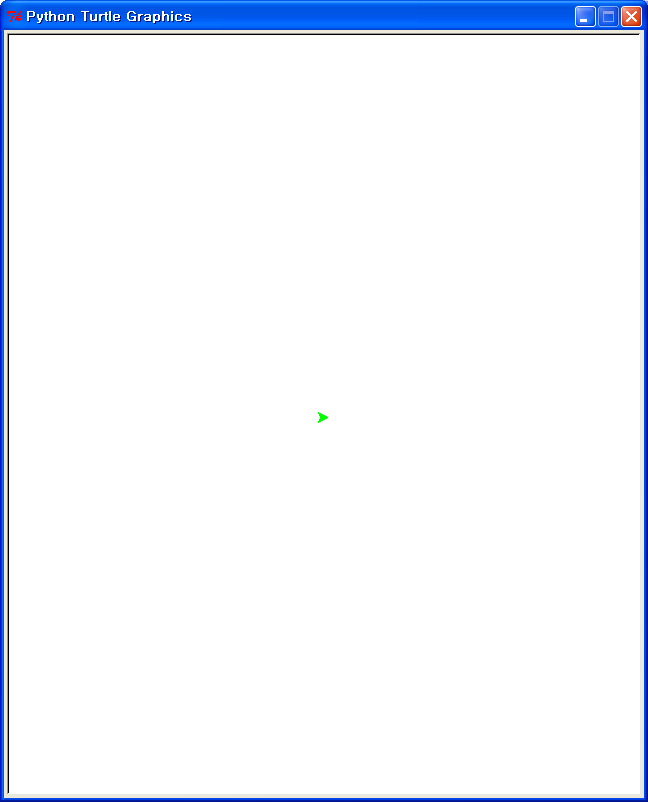
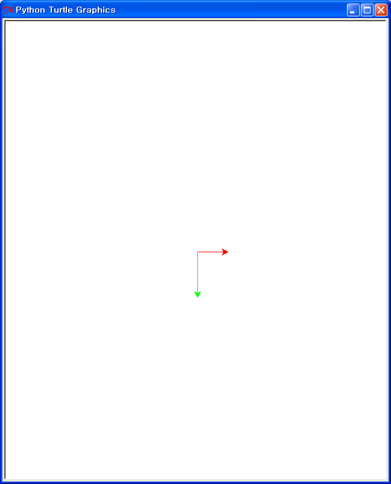

> ## 학습 목표 {.objectives}
>
> *   거북이 다수를 생성하고 제어한다.
> *   상태를 기록하는 인스턴스 변수(instance variable) 사용한다.

그리기하는데 단지 한마리 거북이를 사용할 필요는 없다:
`turtle` 라이브러리를 통해서 원하는 수만큼 거북이를 생성할 수 있다.
시작하기 위해서, `turtle` 라이브러리에서 `Turtle` (대문자 'T') **클래스**를 가져온다.

~~~ {.input}
>>> from turtle import Turtle
~~~

다음과 같이 `slowpoke`(궁뱅이)라는 새로운 거북이를 생성한다:

~~~ {.input}
>>> slowpoke = Turtle()
~~~

그리고, 다음과 같이 거북이를 이동한다.

~~~ {.input}
>>> slowpoke.forward(50)
~~~

이제 두번째 `speedy`(빠른) 거북이를 생성하고 아래쪽으로 이동한다.

~~~ {.input}
>>> speedy = Turtle()
>>> speedy.right(90)
>>> speedy.forward(75)
~~~

이 거북이가 저 거북인지 추적하기 어려울 수 있다.
그래서, 시작 위치로 다시 되돌려 놓고 색깔을 변경한다:

~~~ {.input}
>>> slowpoke.reset()
>>> speedy.reset()
>>> slowpoke.color('red')
>>> speedy.color('green')
~~~

`speedy` (녹색 거북이)만 볼 수 있는데 이유는 `slowpoke` 위에 있기 때문이다.
다시 움직여보자.

~~~ {.input}
>>> slowpoke.forward(50)
>>> speedy.right(90)
>>> speedy.forward(75)
~~~

이제 다음과 같이 시도해보자.

~~~ {.input}
>>> print slowpoke.position()
~~~

~~~ {.output}
(50.00,0.00)
~~~

~~~ {.input}
>>> print speedy.position()
~~~

~~~ {.output}
(0.00,-75.00)
~~~

짝 `(50.00,0.00)`을 **튜플(tuple)**이라고 부른다.
파이썬은 튜플을 사용해서 (x,y) 좌표계처럼 부분을 갖는 값을 저장한다.

`speedy`와 `slowpoke`의 위치가 주어지면,
약간의 삼각법을 통해서 `speedy`가 `slowpoke` 쪽으로 향하는 방법을 해결할 수 있다.
매우 일반적인 연산 작업이라 `turtle` 라이브러리가 본 작업을 수행하는 방법을 제공한다.

~~~ {.input}
>>> slowpoke_coords = slowpoke.position()
>>> print speedy.towards(slowpoke_coords)
~~~
~~~ {.output}
56.309932474
~~~

실제로 이것이 `speedy`가 `slowpoke` 쪽으로 방향을 돌리는데 필요한 정보라기 보다는 오히려
`speedy`가 방향을 돌리는데 필요한 절대 기수방위(heading)가 된다.
운좋게도 (이것이 의미하는 바는 "어느 프로그래머가 이미 코드를 작성했기 때문에"라는 것이다) 
거북이가 이것에 대한 메쏘드를 갖고 있다. `speedy` 방향을 돌려 약간 앞으로 전진시켜보자.
그렇게 해서, 올바른 궤적에 있는지 살펴볼 수 있다.

~~~ {.input}
>>> new_heading = speedy.towards(slowpoke_coords)
>>> speedy.setheading(new_heading)
>>> speedy.forward(75)
~~~

이제 한 거북이가 또다른 거북이를 뒤쫓을 수 있는 방법을 갖게 되었다.
느린 거북이--- 이 시나리오에서 사냥감 ---는 고정된 경로를 따라 이동할 것이다.
매번 빠른 거북이--- 포식자 ---가 이동할 때마다, 느린 거북이쪽을 향하고 쫓아간다.
적은 이동 단계(한번에 몇 픽셀)를 사용해서 모의시험이 좀더 현실감 있게 보이도록 한다.
`turtle.penup`과 `turtle.pendown`을 사용해서 그리기를 활성화 혹은 비활성화 시킨다.
그렇게 함으로써 화면에 선을 남기지 않고 각자의 시작 위치로 이동할 수 있다.
`turtle.setposition` 메쏘드는 거북이를 절대 위치로 이동시킨다.

다음에 프로그램 시작 부분이 있다.

~~~ {.input}
>>> # Get slowpoke into position
>>> slowpoke.reset()
>>> slowpoke.color('red')
>>> slowpoke.penup()
>>> slowpoke.setposition((60, 0))
>>> slowpoke.pendown()

>>> # Get speedy into position
>>> speedy.reset()
>>> speedy.color('green')
>>> speedy.penup()
>>> speedy.setposition((0, -75))
>>> speedy.pendown()
~~~

이만큼 진도를 나가게 되면 멈춰서 지금 하고 있는 것에 대해서 좀더 주의깊이 생각할 필요가 있다.
프로그램 첫 5 줄은 다음을 제외하면 똑같다.

*   움직일 거북이가 무엇인가.
*   거북이를 무슨 색깔을 입힐 것인가.
*   어디서 출발할 것인가.

아마도 여러번 이것을 수행할 것이기 때문에, 상기 작업을 수행하는 것을 함수로 작성하거나 작성해야만 한다.
다음에 함수가 있다:

~~~ {.input}
>>> def setup(this_turtle, color, position):
...     this_turtle.reset()
...     this_turtle.color(color)
...     this_turtle.penup()
...     this_turtle.setposition(position)
...     this_turtle.pendown()
~~~

이제 다음과 같이 거북이를 위치시킬 수 있다.

~~~ {.input}
>>> setup(slowpoke, 'red', (60, 0))
>>> setup(speedy, 'green', (0, -75))
~~~

이것은 *거의* 앞에서 작업한 것이다 --- 
유일한 차이점은 `speedy`가 이제 방향을 아래쪽이 아닌 오른쪽을 향한 것이다.
왜냐하면, 방향을 돌려 위치로 이동하기 보다 위치만 지정했기 때문이다.
잠시 생각 시간을 가진 뒤에 더이상 신경쓰지 않기로 한다. 그래서 함수를 그대로 놔둔다.

이제 거북이를 이동하는 코드를 작성하자.

~~~ {.input}
for step in range(50):
    slowpoke.forward(3)
    slowpoke_coords = slowpoke.position()
    new_heading = speedy.towards(slowpoke_coords)
    speedy.setheading(new_heading)
    speedy.forward(5)
~~~

이것이 찾고 있던 곡선이다. 하지만, 만약 모의 시험을 실행한 것을 본다면 (즉, 거북이가 그리는 것을 관찰한다)
`speedy`가 종종 `slowpoke` 보다 앞서가고, 주위를 맴돌고, 다시 돌아와서는 추적을 재개하기 위해서 다시 주위를 맴돈다.
나중에 이 문제에 대해서 다룰 수 있다; 지금 당장은 생각해야 되는 것이 루프를 작성할 더 좋은 방법이 있느냐는 것이다.
`turtle.towards`를 좀더 자세하게 살펴보자.

~~~ {.input}
>>> help(turtle.towards)
~~~
~~~ {.output}
towards(x, y=None)
    Return the angle of the line from the turtle's position to (x, y).
    
    Arguments:
    x -- a number   or  a pair/vector of numbers   or   a turtle instance
    y -- a number       None                            None
    
    call: towards(x, y)         # two coordinates
    --or: towards((x, y))       # a pair (tuple) of coordinates
    --or: towards(vec)          # e.g. as returned by pos()
    --or: towards(mypen)        # where mypen is another turtle
    
    Return the angle, between the line from turtle-position to position
    specified by x, y and the turtle's start orientation. (Depends on
    modes - "standard" or "logo")
    
    Example:
    >>> pos()
    (10.00, 10.00)
    >>> towards(0,0)
    225.0
~~~

아직 모두 일리가 있지는 않는다 --- 예를 들어, 다음 학습까지 `None`을 마주치지 않을 것이다 ---
하지만, 다음 라인이 흥미롭게 보인다. 

~~~ {.output}
    --or: towards(mypen)        # where mypen is another turtle
~~~

확실하게도 `slowpoke` 좌표를 얻을 필요는 없다. 
`speedy`에게 그 지점으로 향하는 방법을 물어본다: 
`speedy`가 `slowpoke` 쪽을 향하게 물어노다. 
거북이를 처음 출발 위치로 되돌려 놓자.

~~~ {.input}
>>> setup(slowpoke, 'red', (60, 0))
>>> setup(speedy, 'green', (0, -75))
~~~

(다시 모든 명령어를 모두 타이핑하는 것보다 더 쉽다. 그렇지 않나요?) 
`speedy`가 얼마나 방향을 돌려야하는지 물어봅시다.

~~~ {.input}
>>> print speedy.towards(slowpoke)
~~~
~~~ {.output}
51.3401917459
~~~

고쳐야되는 또다른 것은 코드에 있는 **마술 숫자(magic numbers)**다.
내일, 다음주, 혹은 지금으로부터 6개월 뒤에 이 코드를 다시 들여다보게 된다면,
50, 3, 5 가 무엇에 사용되는지 이해하는데 한참이 걸릴지도 모른다. 
이 숫자에 이름을 부여하자.

~~~ {.input}
>>> STEPS = 50
>>> SLOW = 3
>>> FAST = 5

>>> for step in range(STEPS):
...     slowpoke.forward(SLOW)
...     new_heading = speedy.towards(slowpoke)
...     speedy.setheading(new_heading)
...     speedy.forward(FAST)
~~~

원 프로그램 보다 3줄 더 길지만, 이해하기가 더 쉬워졌다.
모의 시험을 제어하는 모든 매개변수가 명확하게 이름을 붙였고, 한 곳에 몰아 넣었다.
그래서, 만약 다른 증가 크기(즉, 속도)와 다른 모의 시험 길이를 갖는다면,
즉시 무엇을 변경시킬지 알 수 있게 된다. 
이것을 가지고 더 잘 할 수 있다. 함수에 모의시험 핵심 루프에 이를 반영한다. 

~~~ {.input}
>>> def run():
...     for step in range(STEPS):
...         slowpoke.forward(SLOW)
...         new_heading = speedy.towards(slowpoke)
...         speedy.setheading(new_heading)
...         speedy.forward(FAST)
~~~

모의 시험을 실행하기 위해서, 이제 해야되는 것은 다음과 같다:

~~~ {.input}
>>> setup(slowpoke, 'red', (60, 0))
>>> setup(speedy, 'green', (0, -75))
>>> run()
~~~
